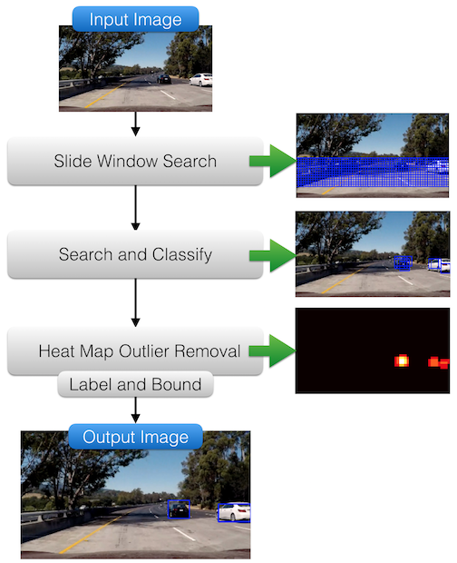

# Self-Driving Car Nanodegree
# Vehicle and Tracking with Support Vector Machines

### Overview

### Included Files

This project was written in Python. The follwing files were used to create an test the model.

1. `Advanced Lane Finding - Oscar Argueta.ipynb`: Used to develop the lane detection algorithm. Detailed explanations and figures can be found in this jupyter notebook 
2. `camera_calibration.py`: Python script that calibrates camera using the images in the `camera_cal` directory. Generates the pickle file `dist_pickle.p` containing the camera matrix and distortion coefficients
3. `writeup.md`: Detailed report that includes detailed description of the code used in each step and You should image examples to demonstrate how the code works
4. `project_video.mp4`: Video stream to run the lane detection algorithm on
5. `result.mp4`: Output video with detected lane projected onto the road in the video stream

### Algorithm
The following are the steps to detect road lane lines robustly:

The diagram below summarizes the pipeline to process images.

## Results

## How to run

1. Install [anaconda](https://www.continuum.io/downloads)
2. Install and activate the [carnd-term1](https://github.com/udacity/CarND-Term1-Starter-Kit) conda environment
3. Run `$ python camera_calibration.py` to obtain distortion correction parameters in a pickle file called `dist_pickle.p`
4. Run ` $ jupyter notebook` on the directory containing the IPython notebook and open `Advanced Lane Detection - Oscar Argueta.ipynb`